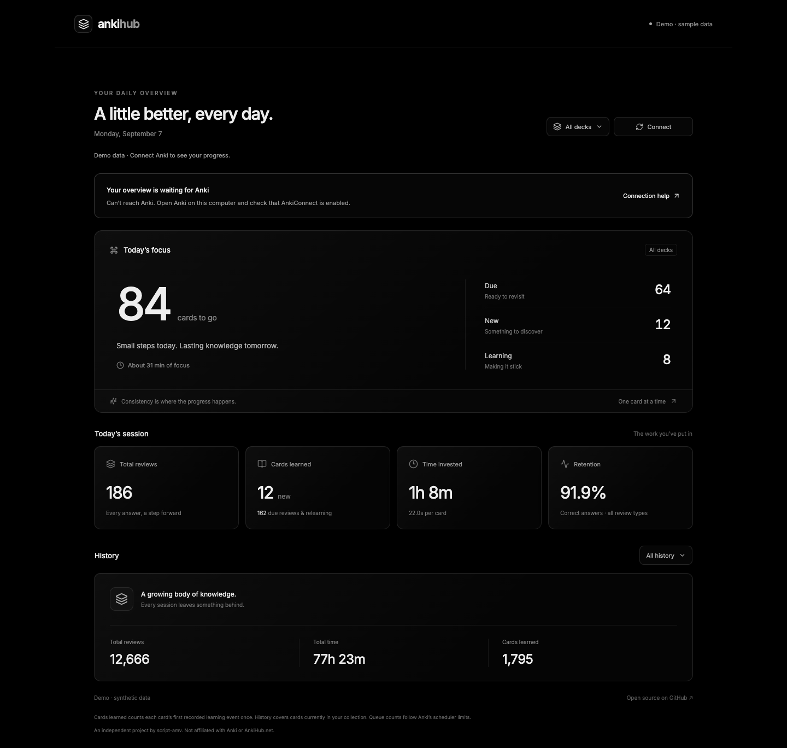

<div align="center">

# AnkiHub

**A little better, every day.**

A quiet, glass dashboard for your daily Anki practice.

[Open the demo](https://ankihub.vercel.app) · [Report an issue](https://github.com/script-amv/ankihub/issues) · [Release notes](CHANGELOG.md)

[](https://github.com/script-amv/ankihub/actions/workflows/ci.yml)
[](LICENSE)



</div>

AnkiHub brings your remaining cards, today's progress, and long-term effort into one monochrome dashboard. Built with React, TypeScript, and Vite; inspired by Raycast's visual design.

This is an independent project by [script-amv](https://github.com/script-amv), **not affiliated with Anki or AnkiHub.net**.

## What you get

- **Today's focus:** due, new, and learning queues, a time estimate based on today's pace, and a little encouragement.
- **Today's session:** reviews, learning activity, study time, seconds per card, and overall answer retention.
- **All history:** total reviews, time invested, and new learning events.
- **Deck filters:** your whole collection or a parent deck and its children.
- **A no-setup demo:** realistic synthetic data, with no requests to Anki.
- **Read-only integration:** live data comes directly from AnkiConnect on your computer.

## Connect your Anki

The demo works without installing anything. Live stats require **desktop Anki on the same computer as your browser**.

1. Install [AnkiConnect](https://ankiweb.net/shared/info/2055492159) in Anki using add-on code `2055492159`, then restart Anki. API v6 is required.
2. Open **Tools → Add-ons → AnkiConnect → Config**. Add the deployed origin to the existing `webCorsOriginList`, preserving any entries you already use:

   ```json
   "webCorsOriginList": ["http://localhost", "https://ankihub.vercel.app"]
   ```

3. Restart Anki and keep it open. Open [AnkiHub](https://ankihub.vercel.app), choose **Connect your Anki**, then **Connect**.
4. Allow local-network access when your browser prompts. If your add-on has an API key configured, enter it in the dashboard settings.
5. Match **Study day starts at** to Anki's next-day start preference. The default is **04:00**, using your computer's timezone.

Data refreshes when you connect or press **Refresh**. Reloading the page returns to the demo; credentials and settings are not persisted.

### Troubleshooting

| Symptom | What to check |
| --- | --- |
| Can't reach Anki | Anki is open on this computer; AnkiConnect listens at `127.0.0.1:8765`. |
| Loading pauses on macOS | Bring Anki to the foreground and retry. Background Anki can respond slowly. Large histories also take longer to load. |
| Connection blocked | The exact site origin is allowed in AnkiConnect; restart Anki after changing its config. |
| Browser permission denied | Allow local-network access in the site's browser permissions, then reconnect. |
| Invalid key | Enter the API key configured in AnkiConnect. |
| Today's totals differ | Match the study-day start hour and check the selected deck. |
| A refresh fails | The last successful live snapshot stays visible and is marked stale. |

The supported live setup is desktop Chrome with localhost access allowed. Other browsers may impose different local-network restrictions; the demo remains available. Phones cannot connect to Anki running on another computer through this app's localhost endpoint.

## What the numbers mean

| Metric | Definition |
| --- | --- |
| Cards to go | Scheduler new + learning + review counts, respecting Anki's queue limits. Parent totals include their children once. |
| Total reviews | Answer events with an Again, Hard, Good, or Easy response; unanswered scheduling records are excluded. |
| New learning reviews | Every Learn event, including repeated learning steps—not unique cards. |
| Due activity | Review and Relearn events. Filtered events still contribute to total reviews. |
| Retention | Hard, Good, and Easy responses divided by all valid answers, including learning. No answers displays `—`. |
| Time | Recorded Anki answer durations, rather than wall-clock session time. |
| Estimate | Today's average answer duration × remaining queue count. Repeated learning steps can make actual time longer. |

History covers cards **currently in your collection** and follows their current deck membership. Deleted cards are not returned by the plugin's history endpoint. The plugin does not expose the study-day preference, so it is configured manually here.

## Privacy

Review data and API keys stay in memory in your browser tab. The dashboard sends read-only API requests directly to your local AnkiConnect instance; it has no collection-data backend or analytics. Vercel serves the static app and may retain ordinary hosting request logs. Google Fonts provides the font stylesheet, with a system-font fallback. The screenshots and demo contain only synthetic data.

## Develop locally

Requires Node.js 24 and npm.

```sh
git clone https://github.com/script-amv/ankihub.git
cd ankihub
npm ci
npm run dev
```

Open the URL printed by Vite. For live use, allow that exact origin in AnkiConnect too.

```sh
npm test
npm run build
npx playwright install chromium
npx playwright test
```

On systems that need installed Chrome instead of bundled Chromium, run `PLAYWRIGHT_CHANNEL=chrome npx playwright test`. GitHub Actions runs the unit tests, build, and browser tests on Linux.

## Contribute

Issues and pull requests are welcome. Include reproduction steps and your Anki/browser versions when reporting connection problems; do not attach API keys or personal collection data. Keep the UI monochrome, use synthetic test fixtures, and run the checks above before opening a PR.

## License

[MIT](LICENSE). The license covers this dashboard's source; Anki, AnkiConnect, and Raycast are separate projects.
